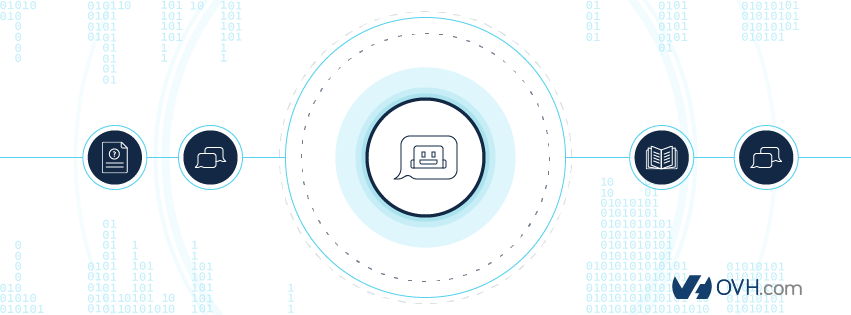

# OVH Chatbot -- Node.Js 

The main goal of this tool is to help [OVH](https://ovh.com) clients in order to have faster responses when you have some problems with OVH services. For example for web hosting you can ask why your website is broken and then this chatbot will find a solution to fix that.

## Setup & run

Visit [INSTALL.md](INSTALL.md) to begin and test it via Facebook Messenger or Slack

## Webhook for Facebook

This project handles callbacks for authentication, messages, delivery confirmation and postbacks. More details are available at the [reference docs](https://developers.facebook.com/docs/messenger-platform/webhook-reference).

## Webhook for Slack

This project handles callbacks for authentication, messages. More details are available at the [reference docs](https://api.slack.com/).

## Project overview

+ [`bots`](bots/README.md) --> Represent all the modules about bot's answers and her specific type with an intention already given
+ [`config`](config/README.md) --> The configuration of tools and configuration variables are in this directory
+ `constants` --> Represent constants of the project
+ [`controllers`](controllers/README.md) --> The controllers contain handler function of an express route
+ `diagnostics` --> Contains all the modules that make diagnostics
+ `models` --> Contains database models
+ [`providers`](providers/README.md) --> Tools used globally in all the project
+ `routes` --> Routes declaration of the API
+ [`platforms`](platforms/README.md) --> Contains all the handlers to communicate with different platforms
+ `utils` --> Contains all the utilities and API connector to make this chatbot works
+ `views`

### Add a new platform [visit this page](platforms/README.md)

### Add a new intent and response [visit this page](bots/README.md)

### Add a new diagnostic

+ At the moment only diagnostics for hosting are made but in order to create a new kind of diagnostic you have to create new file in `diagnostics`.

+ This file must export object with methods to make diagnostics

## Contributing

Go on [Contributing section](CONTRIBUTING.md) and if you have any question come on our [Gitter](https://gitter.im/ovh/ux) to discuss about it.

## Roadmap

+ Refactor
+ Docker compose
+ Documentation
+ Translations
+ When my service is expired ?
+ Monitoring
+ Alerting

## License

3-clause BSD
See the LICENSE file in the root directory of this source tree. Feel free to use and modify the code.